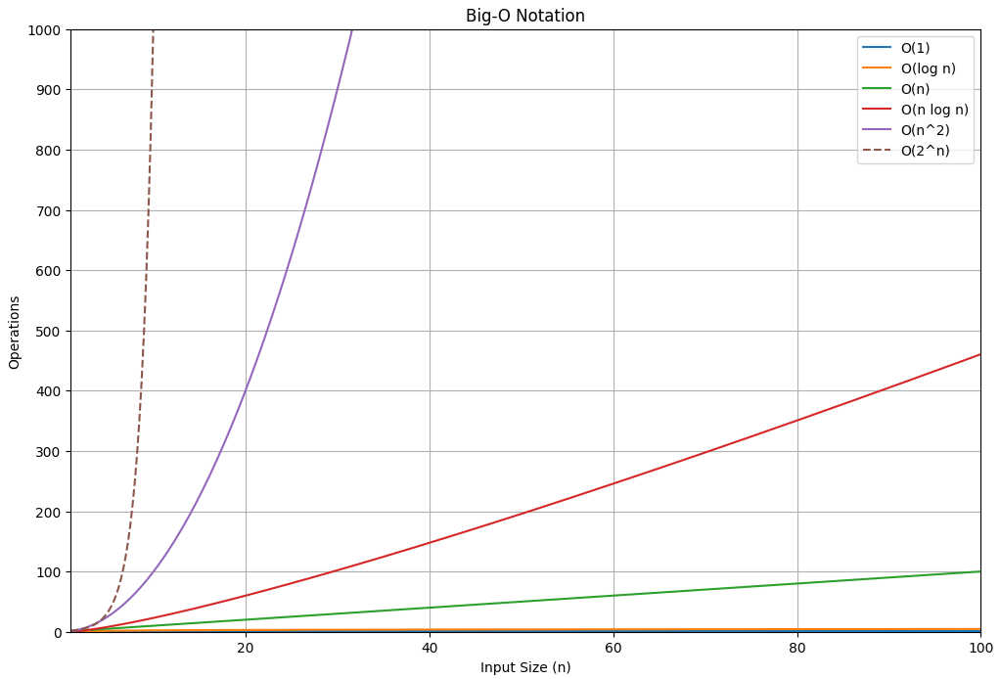

# APS (Algorithm Problem Solving)

## 알고리즘이란?
알고리즘(Algorithm)은 특정 문제를 해결하기 위해 정해진 일련의 절차나 방법을 의미합니다. 즉, 입력을 받아 원하는 출력을 얻기 위해 수행해야 할 일련의 단계들을 정의한 것입니다. 알고리즘은 컴퓨터 과학의 핵심 개념 중 하나로, 다양한 문제를 효율적으로 해결하기 위해 사용됩니다.

## 좋은 알고리즘이란?
좋은 알고리즘은 다음과 같은 특성을 가집니다:
1. **정확성 (Correctness)**: 알고리즘이 문제를 올바르게 해결하는지 여부.
2. **효율성 (Efficiency)**: 알고리즘이 자원을 얼마나 적게 사용하는지, 특히 시간과 공간 자원을 얼마나 절약하는지.
3. **명확성 (Clarity)**: 알고리즘이 이해하기 쉽고, 구현하기 쉬운지.
4. **단순성 (Simplicity)**: 알고리즘이 불필요하게 복잡하지 않은지.
5. **확장성 (Scalability)**: 알고리즘이 문제의 크기가 커져도 잘 동작하는지.

## 알고리즘 성능분석
알고리즘의 성능을 분석하는 것은 매우 중요합니다. 성능 분석은 주로 시간 복잡도와 공간 복잡도를 측정하는 것으로 이루어집니다.

### 시간 복잡도 (Time Complexity)
시간 복잡도는 알고리즘이 실행되는 데 걸리는 시간을 나타냅니다. 입력 크기 \( n \)에 대한 함수로 표현되며, 주로 빅오 표기법(Big-O Notation)을 사용하여 나타냅니다. 예를 들어, \( O(n) \), \( O(\log n) \), \( O(n^2) \) 등이 있습니다.

### 공간 복잡도 (Space Complexity)
공간 복잡도는 알고리즘이 실행되는 동안 필요한 메모리 공간의 양을 나타냅니다. 시간 복잡도와 마찬가지로 입력 크기 \( n \)에 대한 함수로 표현되며, 빅오 표기법을 사용합니다.

### 빅오 표기법 (Big-O Notation)
빅오 표기법은 알고리즘의 성능을 나타내는 데 사용되는 수학적 표기법입니다. 알고리즘의 최악의 실행 시간을 나타내며, 주로 다음과 같은 형태로 표현됩니다:
- \( O(1) \): 상수 시간, 입력 크기에 상관없이 일정한 시간.
- \( O(\log n) \): 로그 시간, 입력 크기의 로그에 비례하는 시간.
- \( O(n) \): 선형 시간, 입력 크기에 비례하는 시간.
- \( O(n \log n) \): 로그 선형 시간.
- \( O(n^2) \): 이차 시간, 입력 크기의 제곱에 비례하는 시간.
- \( O(2^n) \): 지수 시간, 입력 크기의 지수에 비례하는 시간.

빅오 표기법을 통해 알고리즘의 효율성을 비교하고, 더 나은 알고리즘을 선택할 수 있습니다.