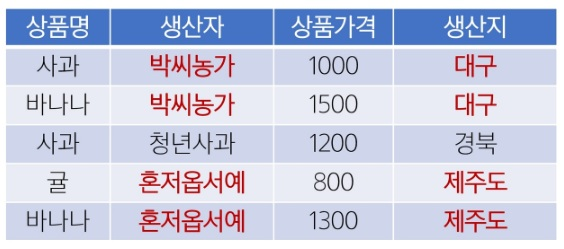
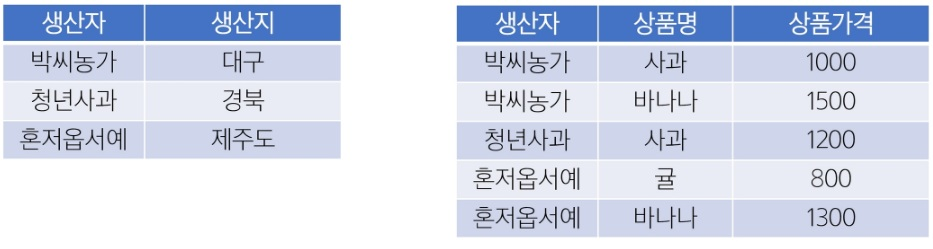
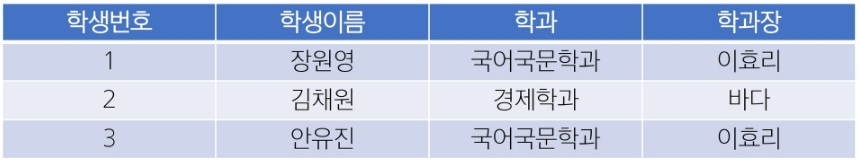
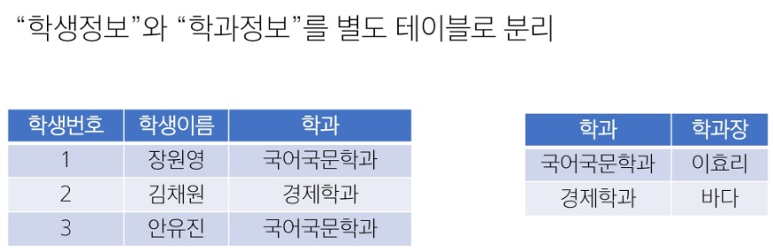
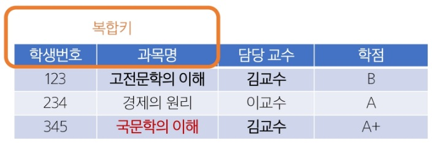
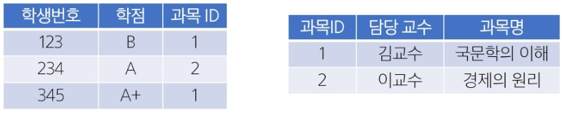

# DB Modeling

- 효율성
  - 쿼리 성능과 저장 효율 향상
- 일관성
  - 중복과 이상현상 최소화, 데이터 모순 및 충돌 방지
- 무결성 보장
  - 무결성 제약 조건을 설정하여 부적절한 데이터를 방지

---

## 무결성(Integrity)

> 잘못된 삽입, 수정, 삭제로 부터 보호되어, **데이터의 일관성과 신뢰성**을 유지

### 개체 무결성(Entity Integrity)

> `PK` 가 **Unique** 하고 `NULL` 값을 허용하지 않는 제약

1. 각 레코드는 유일한 식별자를 가져야 함
2. `PK`는 `NOT NULL`, 즉 필수 값

### 참조 무결성(Referential Intergrity)

> `FK` 관련 제약, 존재하지 않는 기본 키를 참조하지 못하도록 하는 규칙

1. `FK`는 참조 테이블의 `PK`값을 참조하거나 `NULL`을 가질 수 있음
2. 참조 대상 테이블에 존재하지 않는 `PK`값은 사용할 수 없음
3. `FK`로 연결된 레코드를 삭제, 수정할 때 연쇄 작업(ON DELETE CASCADE 등) 또는 예외 처리를 통해 무결성 유지

### 도메인 무결성(Domain Intergrity)

> 각 속성(컬럼)이 **정의된 도메인**(값의 범위, 형식)을 벗어나지 않도록 하는 제약

1. 속성별로 데이터 타입, 길이, 범위 등을 정의
2. 값이 해당 범위(도메인)를 벗어나면 삽입, 수정이 제한되는 규칙

### 그 외 무결성 제약 조건

1. 고유성 (`UNIQUE`)
   - 이메일과 같이 한 사용자가 하나만 사용가능하도록 함
2. `NULL` 무결성 (`NOT NULL`)
   - 특정 컬럼이 `NULL`값을 가질 수 없도록 하는 제약
3. 일반 무결성
   - 추가로 정의하는 무결성 규칙
   - 예: 은행 잔고가 0 미만, 즉 음수가 되지 않도록 하는 규칙 등

---

## 데이터 베이스 모델링 진행

> 요구사항 수집 및 분석 -> 개념적 설계 -> 논리적 설계 -> 물리적 설계

### 요구사항 수집 및 분석

> 어떤 종류의 데이터를 정리하는지 정보 수집하고 어떤 작업을 수행해야 하는지 파악 하는 단계

1. 개체(Entity)
   - 업무에 필요한 정보를 저장하는 집합
2. 속성(Attribute)
   - 관리하고자 하는 것의 의미를 더 이상 작은 단위로 분리되지 않는 데이터 단위
3. 관계(Relationship)
   - 객체 사이의 논리적인 연관성을 의미

### 개념적 설계

> - 요구사항을 기반으로 데이터 베이스의 개념적 모델을 설계
> - 개체와 관계를 식별하고, 개체간의 관계를 정의하여 ERD를 작성

### 논리적 설계

> - 개념적 설계를 기반으로 데이터베이스의 논리적 구조를 설계
> - 테이블, 칼럼(속성), 제약 조건 등과 같은 구체적인 데이터베이스 개체를 정의
> - 정규화를 수행하여 데이터의 중복을 최소화하고 일관성을 유지

### 물리적 설계

> - 논리적 설계를 기반으로 데이터베이스를 실제 **저장 및 운영**할 수 있는 형태로 변환하는 단계
> - 테이블의 인덱스, 파티션, 클러스터링 등 물리적인 구조와 접근 방식을 결정
> - 보안, 백업 및 복구, 성능 최적화 등을 고려하여 데이터베이스를 설정

---

## 정규화

> - 데이터 중복 최소화
> - 이상 현상 예방
> - 재작업을 줄이는 목적으로 테이블을 구조화

1. 중복 최소화
   - 불필요한 중복 데이터를 제거하여 일관성 유지
2. 이상 현상 방지
   - 삽입, 갱신, 삭제 작업 시 발생할 수 있는 불일치 문제 예방
3. 유연성 향상
   - 데이터베이스 구조 변경 시 영향을 받는 영역을 최소화하여 유지보수성을 높임

### 이상 현상(Anomaly)

> 데이터 베이스를 비정상적으로 설계 했을 때 중복된 데이터가 많아져 **삽입, 갱신, 삭제** 등의 연산에서 **비일관성**이 생기는 문제

1. 삽입 이상(Insertion Anomaly)
   - 불필요한 데이터를 함께 삽입해야 하는 문제
2. 갱신 이상(Update Anomaly)
   - 중복된 데이터 중 일부만 변경되어 데이터 불일치가 발생하는 문제
3. 삭제 이상(Deletion Anomaly)
   - 반드시 있어야 하는 정보까지 같이 사라지는 문제

### 제 1 정규형(1NF)

1. 각 속성(컬럼)이 원자 값(Atomic Value), 즉 **하나의 값**만 가져야 함
2. 중복된 컬럼이 없어야 함
3. 각 행이 유일하게 식별될 수 있어야함(개체 무결성(`PK`))

### 제 2 정규형(2NF)

1. 제 1 정규형을 만족
2. 복합 키를 사용하는 테이블에서 **모든 `비 PK` 속성이 `PK`의 모든 컬럼에 완전 종속**되어야 함

### 제 3 정규형(3NF)

1. 제 2 정규형을 만족
2. `PK`에 대한 **이행적 함수 종속**(Transitive Dependency)이 없어야 함
   - A -> B, B -> C 인 경우, A -> C를 "이행 족속"이라 부름
   - `PK`가 아닌 속성이 다른 속성에 의해 결정되지 않아야 함

### BCNF(Boyce Codd Normal Form)

1. 제 3 정규형을 만족해야 함
2. 모든 결정자가 **후보 키(Candidate Key)**여야 함
3. 3NF 이후에도 남아있는 이상 현상을 해결하는 더 엄격한 형태
4. `PK`가 아닌 속성이 다른 컬럼을 결정 할 수 없게 테이블을 분해

- 결정자(determinant) 란?
  - X -> Y를 만족할 때 X를 결정자라고 부름
  - 어떤 속성이 다른 속성을 결정할 때, 그 결정자가 곧 후보 키가 되어야 한다는 규칙

#### 후보 키(Candidate Key)

> - 모든 속성을 결정하는 최소 결정자
> - 한 테이블에 각 행(row)을 유일하게 식별 할 수 있는 속성 중 최소성을 만족하는 키

- 후보 키의 조건
  - 유일성(**Unique**) : 고유하게 식별할 수 있어야 함
  - 최소성(**Minimality**) : 불필요한 컬럼을 포함하지 않는, 최소한의 속성을 조합이어야 함

- 한 테이블에 여러 후보 키가 있을 수 있으며, 그중 하나를 `PK`로 선택해야 함
