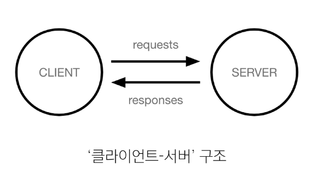

### Client

서비스를 요청하는 주체(웹 브라우저, 모바일 앱 등)

### Server

클라이언트의 요청에 응답하는 주체(웹 서버, 데이터베이스 서버 등)

---

### Frontend

UI를 구성하고, 사용자가 상호작용할 수 있도록 함

- HTML, CSS, JS, FE-Framework 등

### Backend

서버 측에서 동작하며, 클라이언트 요청에 대한 처리와 데이터베이스와의 상호작용을 담당

- BE-Framework, DB, API, 보안 등

---

### 웹 서비스에 필요한 기술

- 로그인/로그아웃, 회원관리, 데이터베이스, 보안 등

> 현대 웹 개발의 핵심
>
> - 잘 만들어진 도구를 효과적으로 활용하는 능력이 중요
> - "거인의 어깨 위에서 프로그래밍하기"
