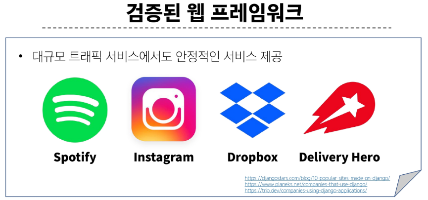
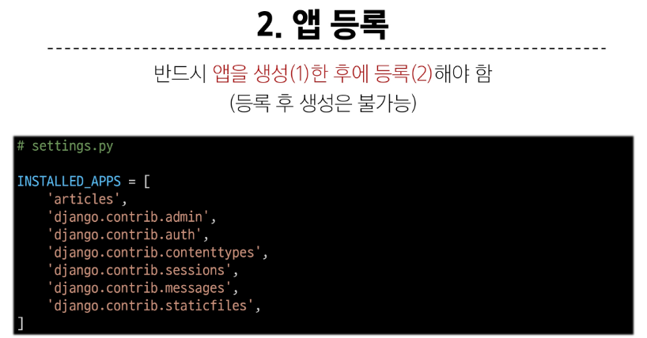
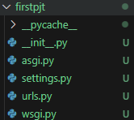
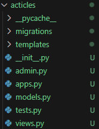

## Django

Python 기반의 대표적인 웹 프레임워크

### 특징

1. **다양성**
   * Python 기반
   * 모바일 앱 백엔드
   * API서버 및 빅데이터 관리
2. **확장성**
   * 대량의 데이터를 유연하게 확장할 수 있는 기능 제공
3. **보안**
   * 기본적인 내장
4. **커뮤니티 지원**
   * 개발자 및 문서, 업데이트를 제공하는 커뮤니티

---

### 가상환경 생성

1. **생성**
   * `$ python -m venv {name}`
   * 관례적으로 {name} = venv 로 사용
2. **활성화**
   * Win :  `$ source {name}/Scripts/activate`
   * Linux/mac : `$ source {name}/bin/activate`
3. **종료**
   * `$ deactivate`

---

### 패키지(Package)

1. **설치**
   * `$ pip install {package-name}`
2. **설치 목록 확인**
   * `$ pip list`
   * 설치 목록 텍스트화 :  `$ pip freeze`
3. **의존성 기록**
   * `$ pip freeze > requirements.txt`
   * 관례적으로 `requirements.txt` 로 저장
   * 자동 업데이트가 안되기 때문에 의존성 패키지 구조가 변경되면, 수기로 업데이트 해주어야 함
4. **기록된 의존성 패키지 설치**
   * `$ pip install -r requirements.txt`

---

### django 명령어

> **1. 설치**
>  `$ pip install django`

> **2. 프로젝트 생성**
> `$ django-admin startproject {project-name} {path} `
>
> `$ django-admin startproject firstpjt .`

> **3. 프로젝트 실행**
> `$ python manage.py runserver`

---

### 디자인 패턴(Design Pattern)

1. **MVC 디자인 패턴**
   * 통상적으로 표현하는 디자인 패턴
   * Model : 데이터
   * View : 사용자 인터페이스
   * Controller : 비즈니스 로직
2. **MTV 디자인 패턴**
   * django 에서 표현하는 디자인 패턴
   * Model : 데이터
   * Template : 사용자 인터페이스
   * View : 비즈니스 로직

---

### Django project

> **애플리케이션의 집합**

- 기능 단위로 app을 구분하여 생성

#### Django application

> 독립적으로 작동하는 기능 단위 모듈

- 앱을 사용하기 위한 순서
  1. 앱 생성 : `$ python manage.py startapp {app-name}`
  2. 앱 등록
     

---

### 프로젝트 구조

1. `settings.py`⭐
   * 프로젝트의 모든 설정을 관리
2. `urls.py`⭐
   * 요청 들어오는 URL에 따라 이에 해당하는 view를 연결
3. `__init__.py`
   * 패키지 인식용 파일
4. `asgi.py`
   * 비동기식 웹 서버와 연결 관련 설정
5. `wsgi.py`
   * 웹 서버와의 연결 관련 설정
6. `../manage.py`
   * Django 프로젝트와 다양한 방법으로 상호작용 하는 커맨드라인 유틸리티

---

### 앱 구조

1. `admin.py`
   * 관리자용 페이지 설정
2. `models.py`
   * DB와 관련된 Model을 정의
   * MTV 패턴의 M
3. `views.py`
   * HTTP 요청을 처리하고 해당 요청에 대한 응답을 반환
   * MTV 패턴의 V
4. `templates/`
   * HTTP 요청에 반환할 페이지 정보를 담는 폴더
   * 개발자가 직접 추가해야 하며, 반드시 "templates" 이름으로 생성
   * MTV 패턴의 T
5. `apps.py`
   * 앱의 정보다 작성된 곳
6. `tests.py`
   * 프로젝트 테스트 코드를 작성하는 곳

> **데이터 흐름**
>
> **URLs -> View -> Template**
