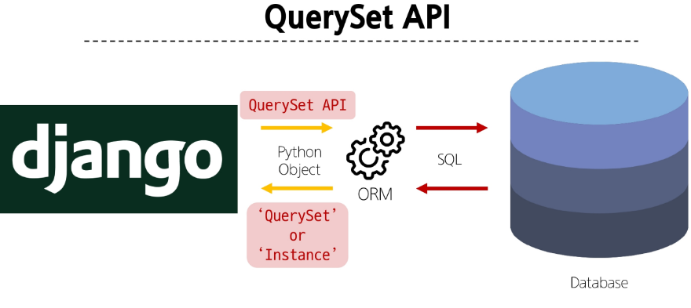
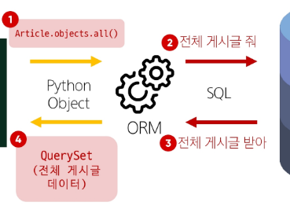

# ORM

> 객체 지향 프로그래밍 언어를 사용하여 호환되지 않는 유형의 시스템 간에
> 데이터를 변환하는 기술

## Django ORM

> Django와 DB간에 소통을 연결
>
> `Python Object <-> ORM <-> SQL`





## CRUD

> 소프트웨어가 가지는 기본적인 데이터 처리기능
>
> - Create
> - Read
> - Update
> - Delete

### create

```python
# models.py
from django.db import models

class A(models.Model):
	data = models.TextField()

# create 1
a = A()
a.data = "data"
# a = A(data = "data")
a.save()

# create 2
A.objects.create(data = "data2")
```

### read

```python
# all : 전체 데이터 가져오기 <QuerySet>
data_set = A.objects.all()

# get : 특정 데이터 가져오기 <Instance>
# 보통 unique 한 조회에서 사용하며,
# 조회된 데이터가 1개가 아니라면 오류를 발생
# 	cnt == 0 : DoesNotExist
# 	cnt > 1  : MultipleObjectsReturned
data = A.objects.get(pk=1)

# filter : 특정 조건의 데이터 가져오기 <QuerySet>
data_set = A.objects.filter(data="data")

```

> QuerySet 으로 반환되는 함수는 항상 list [] 형태로 출력된다.

### update

```python
# 인스턴스를 생성하여 변경
a = A.objects.get(pk=1)
a.data = "변경된 data"
a.save()

# 일괄 변경
A.objects.all().update(data="일괄 변경")
```

> 항상 조회 후에 변경이 일어나야 한다.

### delete

```python
# 인스턴스를 생성하여 삭제
a = A.objects.get(pk=1)
a.delete()
```

> 항상 조회 후에 삭제가 일어나야 한다.


## Field lookups(WHERE)

> 조회(read) 시에 조건을 다양하게 부여

### equals(exact)

```python
A.objects.filter(data='data')
A.objects.filter(data__exact='data')
A.objects.get(data__exact=None)
```

```sql
SELECT * FROM A WHERE data="data";
SELECT * FROM A WHERE data IS NULL;
```

> exact 사용시 Null 과 같은 값은 자동으로 `... WHERE data IS NULL;` 과 같은 형식으로 조회됨

### contains

```python
# 완전 포함
A.objects.filter(data_contains='data')

# 시작에 포함
A.objects.filter(data_startswith='data')

# 끝에 포함
A.objects.filter(data_endswith='data')

# 배열에 포함
A.objects.filter(data_in=['data', 'da', 'x'])
```

```sql
-- 완전 포함
SELECT * FROM A WHERE data LIKE "%data%";

-- 시작에 포함
SELECT * FROM A WHERE data LIKE "data%";

-- 끝에 포함
SELECT * FROM A WHERE data LIKE "%data";

-- 배열에 포함
SELECT * FROM A WHERE data IN ("data", "da", "x");

```

### than

```python
A.objects.filter(value__lt=10) # lt = less than
A.objects.filter(value__lte=10) # lte = less than or equals to
A.objects.filter(value__gt=10) # gt = greater than
A.objects.filter(value__gte=10) # gte = greater than or equals to
```

```sql
SELECT * FROM A WHERE value < 10;
SELECT * FROM A WHERE value <= 10;
SELECT * FROM A WHERE value > 10;
SELECT * FROM A WHERE value >= 10;
```

### range(between)

```python
import datetime

start_date = datetime.date(2005, 1, 1)
end_date = datetime.date(2005, 3, 31)
A.objects.filter(pub_date__range=(start_date, end_date))
```

```sql
SELECT * FROM A WHERE pub_date BETWEEN '2005-01-01' and '2005-03-31';
```

### date

```python
# 연도 비교
A.objects.filter(pub_date__year=2005)
A.objects.filter(pub_date__year__gte=2005)

# 월 비교
A.objects.filter(pub_date__month=12)
A.objects.filter(pub_date__month__gte=6)

# 일 비교
A.objects.filter(pub_date__day=3)
A.objects.filter(pub_date__day__gte=3)
```

```sql
-- 연도 비교
SELECT ... WHERE pub_date BETWEEN '2005-01-01' AND '2005-12-31';
SELECT ... WHERE pub_date >= '2005-01-01';

-- 월 비교
SELECT ... WHERE EXTRACT('month' FROM pub_date) = '12';
SELECT ... WHERE EXTRACT('month' FROM pub_date) >= '6';

-- 일 비교
SELECT ... WHERE EXTRACT('day' FROM pub_date) = '3';
SELECT ... WHERE EXTRACT('day' FROM pub_date) >= '3';
```

> 시간 비교는 __hour, __minute, __second 를 사용하여 비교

### is null

```python
A.objects.filter(pub_date__isnull=True)
```

```sql
SELECT ... WHERE pub_date IS NULL;
```

### regex

```python
A.objects.get(title__regex=r"^(An?|The) +")
```

```sql
SELECT ... WHERE title REGEXP BINARY '^(An?|The) +'; -- MySQL
SELECT ... WHERE REGEXP_LIKE(title, '^(An?|The) +', 'c'); -- Oracle
SELECT ... WHERE title ~ '^(An?|The) +'; -- PostgreSQL
SELECT ... WHERE title REGEXP '^(An?|The) +'; -- SQLite
```
