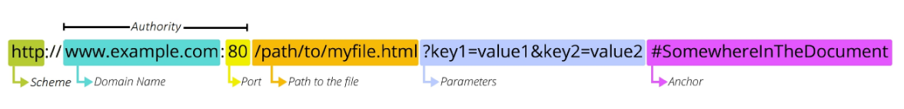

# RESTful API

> REST 원리를 따르는 시스템
>
> '자원을 정의'하고 '자원에 대한 주소를 지정'하는 전반적인 방법을 서술

## REST

> Representational State Transfer
>
> API 서버를 개발하기 위한 일종의 소프트웨어 설계 방법론

## REST API

> REST라는 설계 디자인 약속을 지켜 구현한 API

* 실제활용 예시
  * Naver Cloud API
  * Kakao Login API
* 자원 활용
  1. URI : 자원의 식별
  2. HTTP Methods : 자원의 행위
  3. JSON : 자원의 표현

### URI

> Uniform Resource Identifier, 통합 자원 식별자
>
> 인터넷에서 리소스(자원)를 식별하는 문자열
>
> - 가장 일반적인 URI는 URL

### URL

> Uniform Resource Locator, 통합 자원 위치
>
> 웹에서 주어진 리소스의 주소

1. Schema(or Protocol)
   * 브라우저가 리소스를 요청하는 데 사용해야 하는 규약
   * http, https, mailto, ftp 등 존재
2. Domain Name
   * 요청중인 웹 서버를 나타냄
   * IP 주소 대신 Domain Name을 사용함
3. Port
   * 웹 서버의 리소스에 접근하는데 사용되는 기술적인 문(Gate)
   * 표준 포트 번호
     * HTTP - 80
     * HTTPS - 443
   * 표준 포트만 작성 시 생략 가능
4. Path
   * 웹 서버의 리소스 경로
   * 오늘날에는 실제 위치가 아닌 추상화된 형태의 구조를 표현
5. Parameters
   * 웹 서버에 제공하는 추가적인 데이터
   * '&' 기호로 구분되는 key-value 쌍 목록
6. Anchor
   * 북마크, 브라우저에 해당 지점에 있는 콘텐츠를 표시
   * 요청시 서버에 전달되지는 않고 브라우저에게 해당 지점으로 이동할 수 있도록 함
